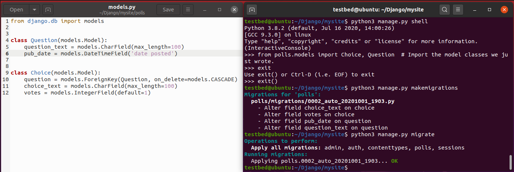

# CYBR8470: Secure Web Application Development
Professor: Dr. Hale  
Student:   Robert Ernewein

## Lab 4: Django Tutorial  

### VM Setup

Platform: ASUS X555D  
Host OS: Windows 10 Home (Build 1903)  
No AMD-V/RVI support

Host VM: VMWare Workstation Pro (v15.5.0)  
Emulating AMD-V/RVI  
VM OS: Ubuntu 20 LTS

### Part I: Setup/Installation  

python (v3.8.2)  
pip (v20.0.2)  
django (v3.1.2)  

First View  

### Part II: Database Setup  

Create/Migratrate Polls   

Change Models  

Note: My first changes to model.py broke syntax/structure and I had to rebuild from scratch.  

Django Admin  

### Part III: Views and Templates  

Render Views  

Name Spacing  

### Part IV: Forms and Views  

View Results   

Generic Views  

### Part V: Testing  

Create Test Cases  

Adding Test Cases  

Note: I ran into an issue implementing the create_question shortcut at the end of Step 5. It may have been the question I added to the database. I corrected the datatime error. Django default: PDT 
